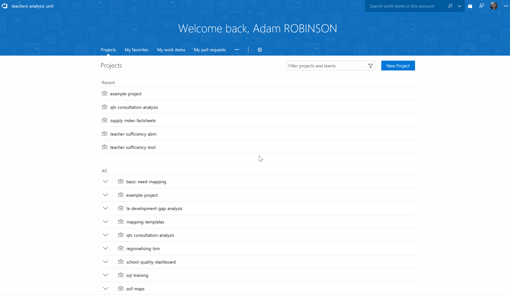
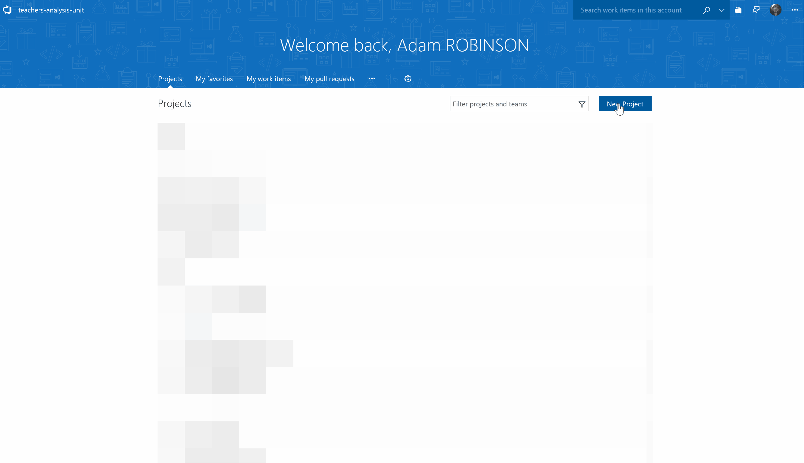
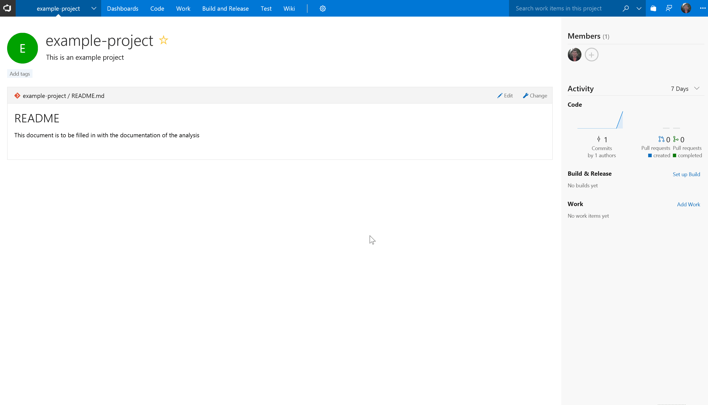
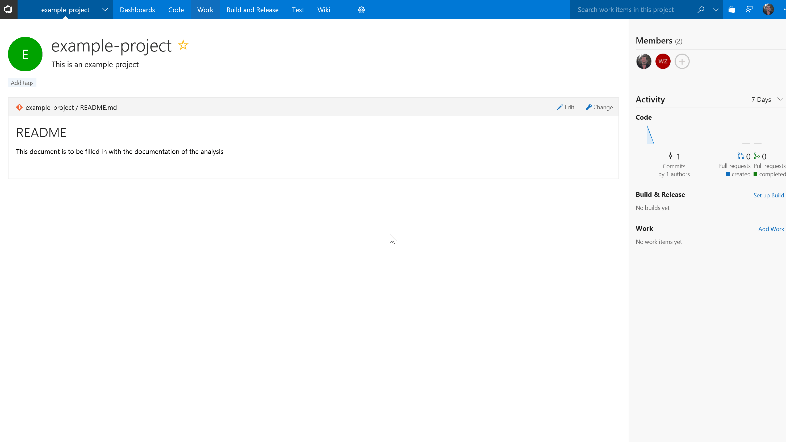
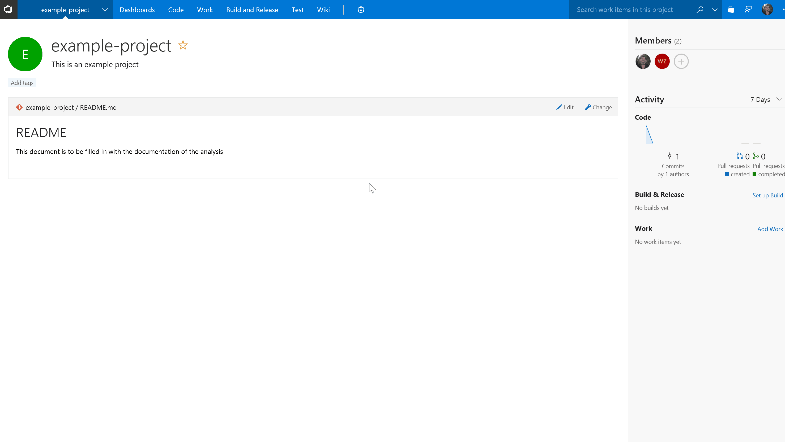

# VSTS Getting Started

## Background

So far we have only looked at git in the context of local projects and command line software. This alone doesn't make collaborating on code easy. 

What is needed is a central platform where people can request for changes to be made to the code base and update their code based on changes by others.  

This concept in git is known as [remotes](https://git-scm.com/book/en/v2/Git-Basics-Working-with-Remotes). The following are examples of interactive services that allow you to manage git projects effectively:

- [GitHub](github.com)
- [Bitbucket](https://bitbucket.org)
- [GitLab](gitlab.com/)
- [Visual Studio Team Services](https://www.visualstudio.com/team-services/).

We are using **Visual Studio Team Services** as this is the Department's tool of choice for internal version control. We would use platforms such as GitHub for our more publicly facing projects (such as this book).

## Theory 

At a high level when you are using VSTS (or any type of remote) you are creating a central copy of your code on a server (the VSTS site). 

The aim of any project is to get your final complete code on to the master branch of the server copy. Analysts will still make and run all their changes locally but will then use the concepts of *pushing*, *pulling* and *pull requesting* to get the VSTS version up to date.

Having this central repository and the approval processes that VSTS provides means that multiple analysts can work on a project at the same time and systematically merge all their changes into the final version after code review.

The following diagram illustrates the concept of server and local copies. 

## Generating Git Credentials

Before we get started we can create some credentials that we will be asked for later on to log your local git into VSTS.

To do this you need do the following:

1. Click on your user icon on the top right
2. Hit Security
3. Hit Personal Access Tokens 
4. Create Credentials

The following clip outlines the process:

## Setting up a Repository

To set up a repository on VSTS you simply hit new project on the homepage and fill in the project details. 

This will create you an empty git repo on VSTS.

The following clip outlines the process:

**Note:** Not all users will have permissions to create projects on VSTS. They will instead ask for them to be created by their VSTS admin.

## Adding an Existing Project

When you first create a VSTS project it will create a blank repo. You then have multiple options on what to do from there. 

The Two main options are 

1. Clone to your computer (cloning will be explained in *Cloning a repository*)
2. Push an Existing repository (Will go into detail later)

If you have already been working on a project locally you may wish to push this up and use this as the starting point for the collaborative workflow.

In order to Push an existing repository you need to do the following:

1. Select the *or push an existing repository from the command line option*
2. Git Bash in your local git repo
3. Copy the code and run it

This will set up the connection to VSTS and push an entire copy of the repo up to VSTS.

The following clip outlines this process:

**Note:** The first time you do this you will be asked for VSTS credentials created previously.

## Adding users to a project

VSTS is a locked down code environment where users need to first be given permission to access the site as a whole and then individual projects. 

To add users to a project you simply do the following on a project home page:

1. Click + button under members
2. Search for user
3. Hit Add

The user will then get a welcome email inviting them to the project.

The following clip outlines this process:

## Work Items

VSTS has rich project management functionality that can be used to manage projects of all sizes. At it's most complex you can utilise a mix of Epics, Stories, Features, Tasks, Issues and User stories to manage your project. 

These terms and planning stages for a project come from traditional software development and are likely not neccesary when using the platform for Data Analysis. 

Instead we recommend treating features as the main type of work item and breaking your workload down into a number of features. This is similar to what you would do on GitHub with Issues. 

With Features you can again add lots of metadata but the most useful will be the following:

1. Name
2. Description
3. Assigned to

There are then numerous ways to visualise work allocations accross VSTS ranging from individaul task assignments to project boards (similar to trello boards).
By utilsing work items you take out the need for tracking tasks manually and can use them in future sections to appr

The following outlines adding a work item to the example project:

## Branch Policies

At this point you will have a project that anyone who is a member of has the ability to push directly to the master branch. 

This resource is promoting a workflow in which code is reviewed throughout the development life cycle. Pushing to master doesn't allow this directly. 

Instead what we do is set **Branch Policies** which force code to be reviewed in VSTS before it can be merged into master. 

This comes with various options which are summarised below:

1. **Requiring a minimum number of reviewers** - how many people need to approve the code before it can be merged.
2. **Checking for linked work items** - Does the pull request need to have a work item linked
3. **Checking for comment resolution** - Do all of the comments on the pull request need to be resolved before merging is approved
4. **Merge Strategy** - Do you want to enforce a merge strategy. 
5. **Build testing** - not currently explored.

It is recommended that you **enforce all of the first 3 options** and **set the Merge Strategy to Squash**. 

A **squash merge stategy** squashes all commits you made in a branch on your pull request into one for the whole pull request when merged. This ensures a clean working history rather than lots of minor changes.

The following clip outlines setting branching policies:

